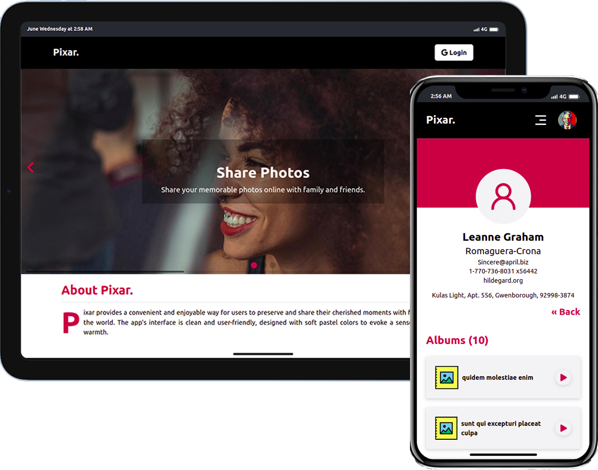

<a name="readme-top"></a>

<!--
HOW TO USE:
This is an example of how you may give instructions on setting up your project locally.

Modify this file to match your project and remove sections that don't apply.

REQUIRED SECTIONS:
- Table of Contents
- About the Project
  - Built With
  - Live Demo
- Getting Started
- Authors
- Future Features
- Contributing
- Show your support
- Acknowledgements
- License

OPTIONAL SECTIONS:
- FAQ

After you're finished please remove all the comments and instructions!
-->

<div align="center">
  <!-- You are encouraged to replace this logo with your own! Otherwise you can also remove it. -->
</div>

<!-- TABLE OF CONTENTS -->

# 📗 Table of Contents

- [📖 About the Project](#about-project)
  - [🛠 Built With](#built-with)
    - [Tech Stack](#tech-stack)
    - [Key Features](#key-features)
  - [🚀 Live Demo](#live-demo)
- [💻 Getting Started](#getting-started)
  - [Setup](#setup)
  - [Prerequisites](#prerequisites)
  - [Install](#install)
  - [Usage](#usage)
  - [Run tests](#run-tests)
  - [Deployment](#triangular_flag_on_post-deployment)
- [👥 Authors](#authors)
- [🔭 Future Features](#future-features)
- [🤝 Contributing](#contributing)
- [⭐️ Show your support](#support)
- [🙏 Acknowledgements](#acknowledgements)
- [❓ FAQ (OPTIONAL)](#faq)
- [📝 License](#license)

<!-- PROJECT DESCRIPTION -->

# 📖 Frontend Engineer Assessment <a name="about-project"></a>

Pixar App provides a convenient and enjoyable way for users to preserve and share their cherished moments with friends, family, and the world. The app's interface is clean and user-friendly, designed with soft pastel colors to evoke a sense of nostalgia and warmth.



<!-- **[your_project__name]** is a... -->

## 🛠 Built With <a name="built-with"></a>

### Tech Stack <a name="tech-stack"></a>

> This project is built with the following Stack.

<details>
  <summary>Client</summary>
  <ul>
    <li><a href="https://reactjs.org/">React.js</a></li>
  </ul>
</details>

<details>
  <summary>Server</summary>
  <ul>
    <li><a href="https://jsonplaceholder.typicode.com/">https://jsonplaceholder.typicode.com/</a></li>
  </ul>
</details>

<!-- Features -->

### Key Features <a name="key-features"></a>

> The application has the following features 

- **A Landing page that describes what the application is about**
- **Enables users to login into the application using GoogleOAuthentication API**
- **A page for listing all the users**
- **A page for displaying User details and his/her albums**
- **An Album details page that lists all the photos in a given album**
- **A photo details page that allows a user to edit the title of a photo in the album**

<p align="right">(<a href="#readme-top">back to top</a>)</p>

<!-- LIVE DEMO -->

## 🚀 Live Demo <a name="live-demo"></a>

> Click on the link below to see live application.

- [Live Demo Link](https://xipar.netlify.app/)

<p align="right">(<a href="#readme-top">back to top</a>)</p>

<!-- GETTING STARTED -->

## 💻 Getting Started <a name="getting-started"></a>

> To get a local copy up and running, follow these steps.

### Prerequisites

In order to run this project you need:
  - node v18.17.0
  - Git

<!--
Example command:

```sh
 gem install rails
```
 -->

### Setup

Clone this repository to your desired folder:

```sh
  $ git clone git@github.com:Felix45/user-social.git
```

### Install

Install this project with:


```sh
  $ cd user-social
  $ npm install
```

### Usage

To run the project, execute the following command:

```sh
  $ npm run dev
```

### Run tests

To run tests, run the following command:

```sh
  $ npm test
```

### See project on localhost

```sh
  $ http://localhost:3000

```

<p align="right">(<a href="#readme-top">back to top</a>)</p>

<!-- AUTHORS -->

## 👥 Author <a name="authors"></a>

| 👤 Name | Github | Twitter | LinkedIn |
|------|--------|---------|----------|
|Felix Ouma|[@Felix45](https://github.com/Felix45)|[@Felix_Atonoh](https://twitter.com/Felix_Atonoh)|[LinkedIn](https://www.linkedin.com/in/felix-ouma)|


<p align="right">(<a href="#readme-top">back to top</a>)</p>

<!-- FUTURE FEATURES -->

## 🔭 Future Features <a name="future-features"></a>

> I intend to add this features in future.

- **Add capability to stream videos using the App**
- **Add capability to edit a photo using the App**


<p align="right">(<a href="#readme-top">back to top</a>)</p>

<!-- CONTRIBUTING -->

## 🤝 Contributing <a name="contributing"></a>

Contributions, issues, and feature requests are welcome!

Feel free to check the [issues page](../../issues/).

<p align="right">(<a href="#readme-top">back to top</a>)</p>


<!-- SUPPORT -->

## ⭐️ Show your support <a name="support"></a>

> If you like this project, please give it a star.

<p align="right">(<a href="#readme-top">back to top</a>)</p>

<!-- FAQ (optional) 
<p align="right">(<a href="#readme-top">back to top</a>)</p>


## ❓ FAQ (OPTIONAL) <a name="faq"></a>

> Add at least 2 questions new developers would ask when they decide to use your project.

- **[Question_1]**

  - [Answer_1]

- **[Question_2]**

  - [Answer_2]

  -->

<!-- <p align="right">(<a href="#readme-top">back to top</a>)</p> -->

<!-- LICENSE -->

## 📝 License <a name="license"></a>

This project is [MIT](./LICENSE) licensed.

<p align="right">(<a href="#readme-top">back to top</a>)</p>
